# Music Gear Review Site

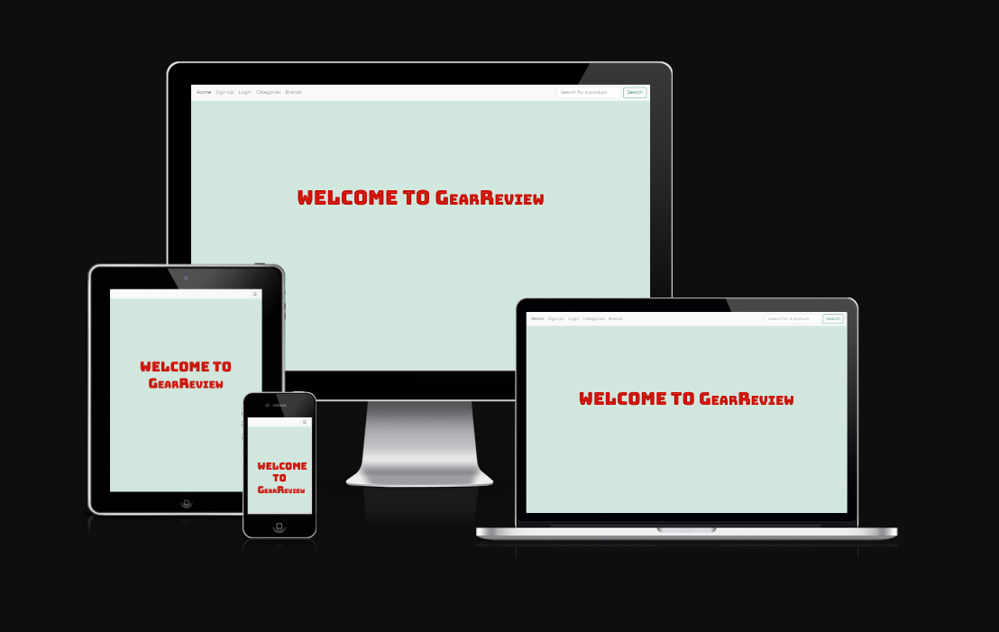

Deployed Website: [Music Gear Review Site](https://gear-review-0801b9de8ec9.herokuapp.com/)

## CONTENTS

* [Project Goal](#Project-Goal)

* [User Experience (UX)](#User-Experience-UX)
  * [User Stories](#User-Stories)

  * [Design](#Design)
    * [Wireframes](#Wireframes)
    * [Typography](#Typography)
    * [Colour Scheme](#Colour-Scheme)
    * [Features](#Features)
    * [Accessibility](#Accessibility)

* [Technologies Used](#Technologies-Used)
  * [Languages Used](#Languages-Used)
  * [Frameworks & Other Libraries/Programs Used](#Frameworks--Other-LibrariesPrograms-Used)
  * [Database Schema](#Database-Schema)

* [Deployment & Local Development](#Deployment--Local-Development)
  * [Deployment](#Deployment)
  * [Local Development](#Local-Development)
    * [Forking a Repository](#Forking-a-Repository)
    * [Cloning a Repository](#Cloning-a-Repository)

* [Testing](#Testing)
  
* [Credits](#Credits)
  * [Code](#Code)
  * [Media](#Media)

## Project Goal 

The goal for this project was to create a simple review site where users can select or add a music product to review. 
Users can create an account and see reviews of other users for different gear.
This site makes for a very convenient and quick way for users to review and see reviews for different music equipment they are interested to purchasin.

## User Experience (UX)

### User Stories

#### Overall Client Goals

1. To be able to search for items within the database
2. To be able leave reviews for different items within the database
3. To be able to add new products to the database, if a user cannot see their desired product

#### First Time Visit Goals

1. To be able to sign up to the site with a unique username and password
2. To be able to leave/delete their own reviews for a specific product
3. To be able to see other peoples reviews of a specific product
4. To be able to search for a product using the site's search functionalities

#### Returning Visitor Goals

1. To be able to have a unique account that they can login into (created from signing up)
2. To be able to edit their account information, i.e. username and password
3. To be able to view their own reviews easily.
4. To be able to delete their personal accounts if they wish

### Design

#### Wireframes

##### Home Page

###### Logged Out

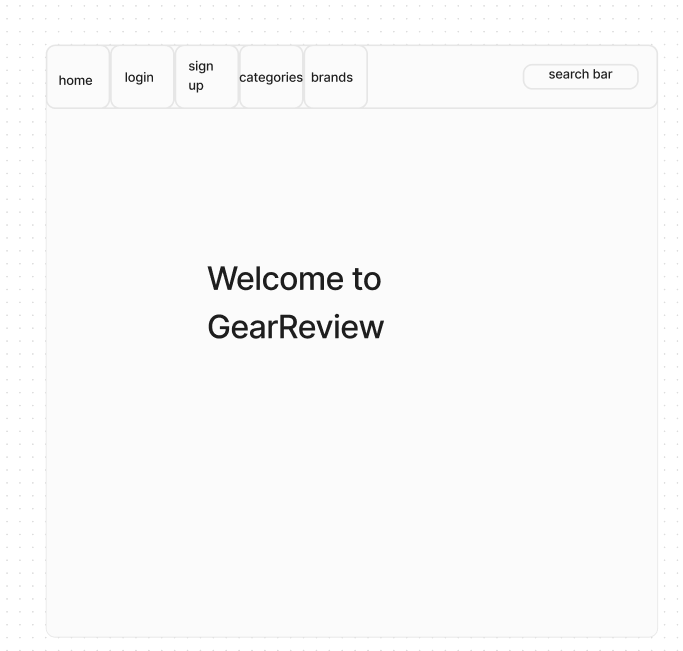

###### Logged In

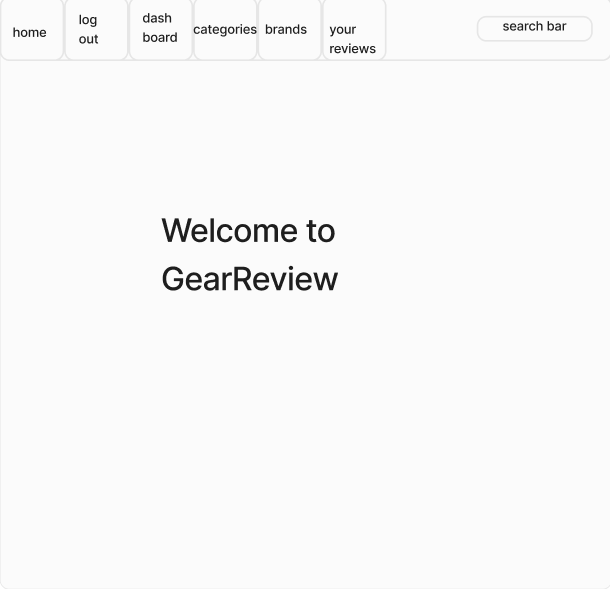

###### Mobile View

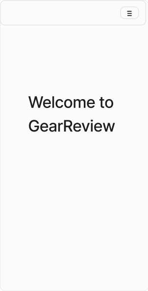

##### Search Page 

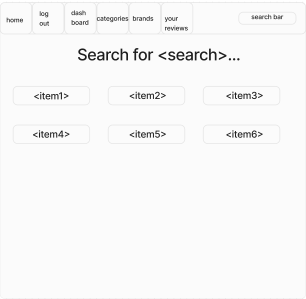

##### Add Product Page 

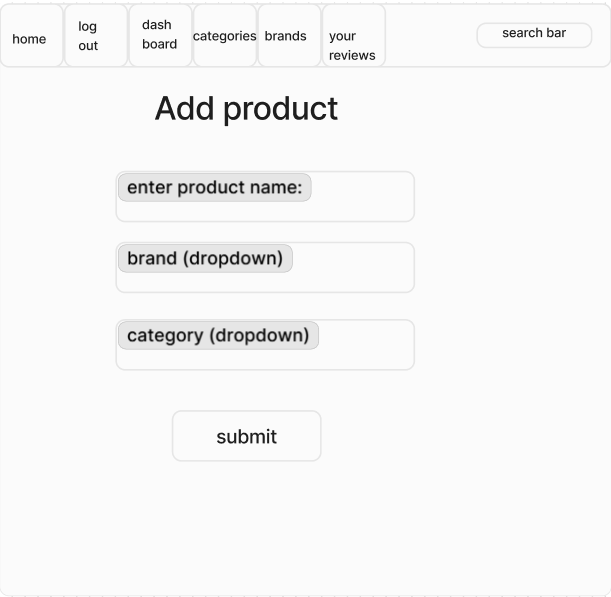

##### Add Review Page 

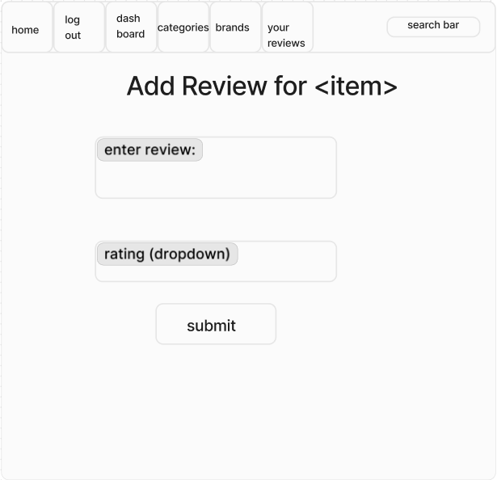

##### About Gear Page

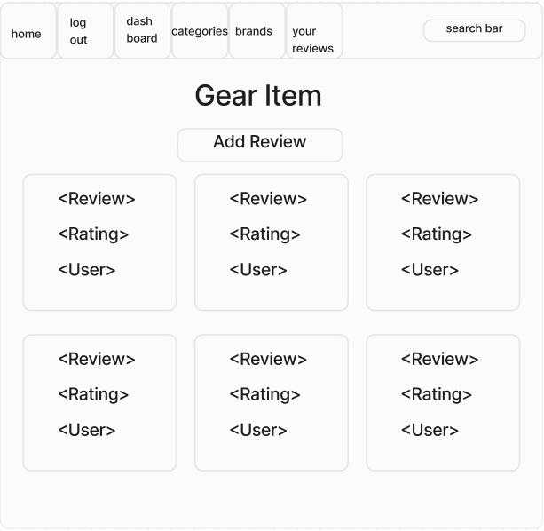

##### Categories Page

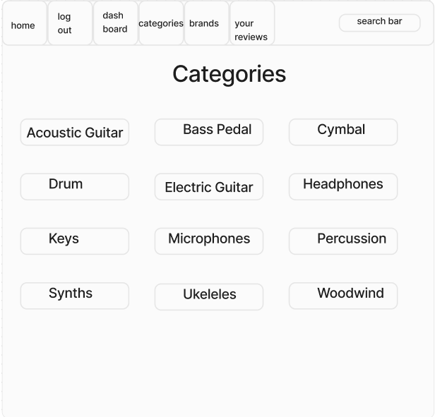

##### Brands Page

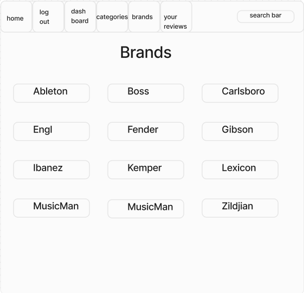

#### Typography

The Website primarily uses 3 different fonts throughout, obtained from Google Fonts. These fonts were:

Bungee Tint ('sans-serif')
Montserrat ('sans-serif')
New Amsterdam ('sans-serif')

"Bungee Tint" is used for the title page, as it is a very stylish looking font.

"Montserrat" is used as the default font for the website text, and "New Amsterdam" is used for the titles of each page, as it is a much bolder looking font, while not being as overly stylistic as "Bungee Tint."

#### Colour Palette

### Technologies Used

#### Languages Used

The programming languages used for this project were:

* HTML5
* CSS3
* Python3

#### Frameworks & Other Libraries/Programs Used

* Git - Version Control
* Github - To save and store changes to the project
* [Bootstrap (v5.3.2)](https://getbootstrap.com/) - CSS and JS framework used. Used mainly for the navbar, grid structure, and button styling.
* [Flask](https://flask.palletsprojects.com/en/3.0.x/) - Python Framework
* [Flask-Login](https://flask-login.readthedocs.io/en/latest/) - Used to provide session management
* [Flask-WTF](https://flask-wtf.readthedocs.io/en/1.2.x/) - Integration of Flask and WTForms, used for Form validation
* [bcrypt](https://pypi.org/project/bcrypt/)
* [Google Fonts](https://fonts.google.com/)- Imported selected fonts into external stylesheet, namely "Bungee Tint", "Montserrat", and "New Amsterdam."
* [Figma](https://www.figma.com/) - Used to create the wireframes.
* [Coolors](https://coolors.co/) - Used to create the colour palette images.
* [Favicon.io](https://favicon.io/) - To create favicon icons.
* [Shields.io](https://shields.io/) - Used to create badges.
* [Am I Responsive?](https://ui.dev/amiresponsive) - Used to create the multi-screen image you see at the start of this document.
* [W3C Markup Validation Service](https://validator.w3.org/) - Used for testing HTML validation.
* [W3C CSS Validation Service](https://jigsaw.w3.org/css-validator/) - Used for testing CSS validation.
* [Wave Web Accessibility Evaluation Tool](https://wave.webaim.org/extension/) - Used for testing webpage accessibility. 

### Database Schema

#### Entity Relationship Diagram

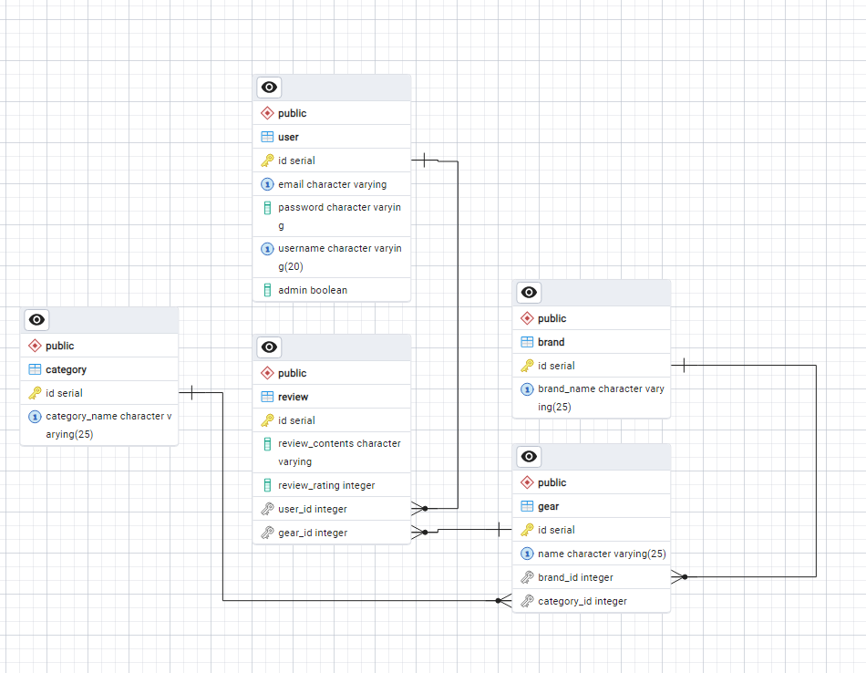

### Features

* Upon entering the size, the user is greeted with the home page, which just welcomes the user.

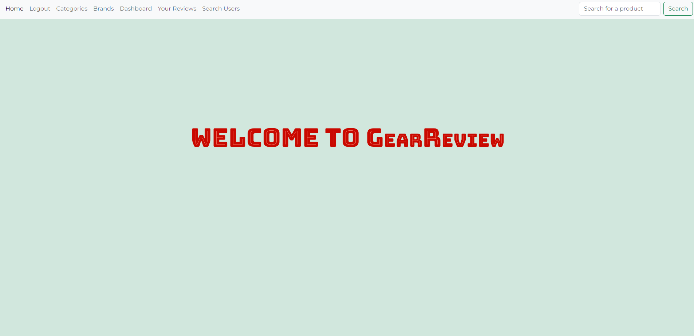

* The user has the option, to sign up, login, or search for a product by either filtering through, brands, categories, or search for a specific item using the search bar.
* If the user hasn't already, they can sign up using the sign section. This stores, their username, email, and hashed password within the database

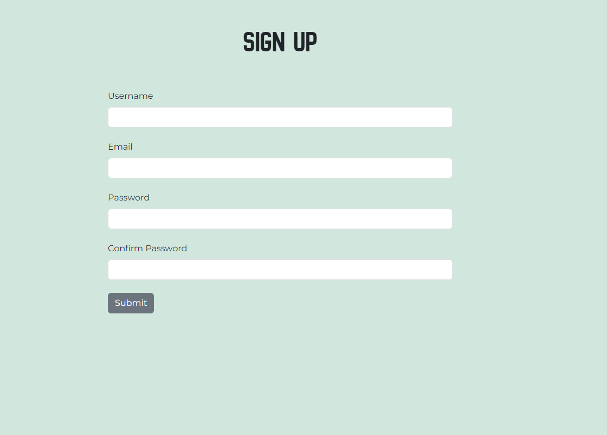

* Once they sign up, they can then log in and access their own personal account.

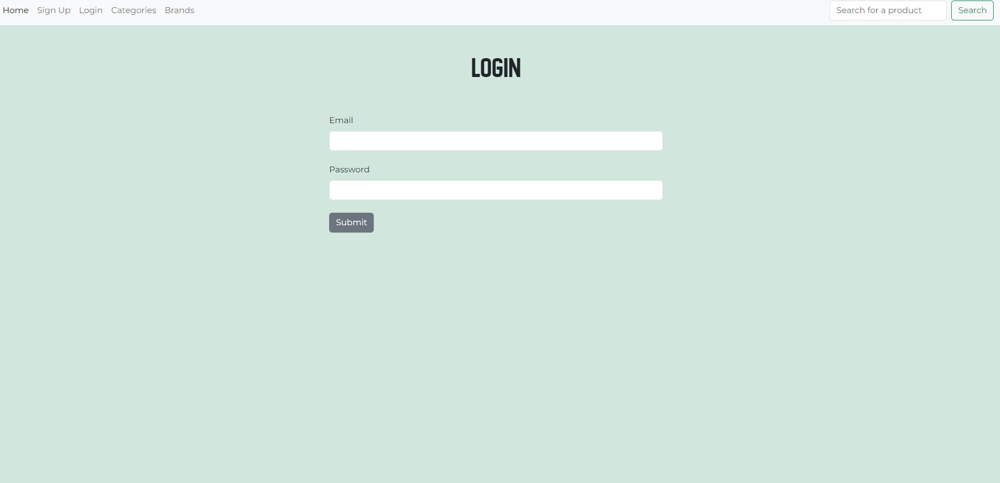

* Users can search for products and see reviews written by other users, and if they have an account they can write a review themselves

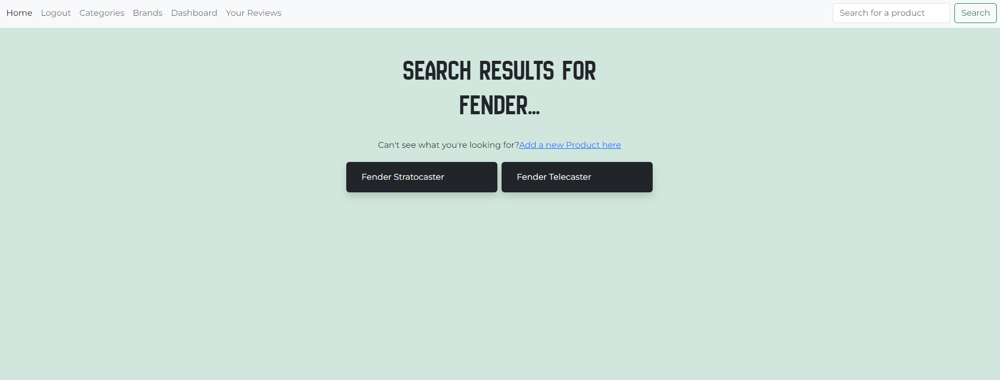
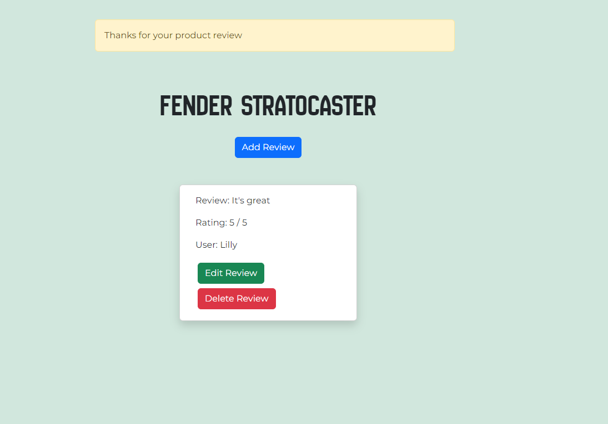
#### Potential Future Feautures

## Deployment & Local Development

### Deployment

Github Pages and Heroku was used to deploy the live website. The instructions to achieve this are below:

1. Login to Heroku

### Local Development

#### Forking a Repository

To fork the repository:

  1. Log in or Sign Up to Github.
  2. Go to the repository for this project, DanArthur99 / Milestone-Project-3.
  3. Click the Fork button in the top right corner.

#### Cloning a Repository

To clone the repository:

  1. Log in or Sign Up to GitHub.
  2. Go to the repository for this project, DanArthur99 / Milestone-Project-3.
  3. Click on the code button, select whether you would like to clone with HTTPS, SSH or GitHub CLI and copy the link shown.
  4. Open the terminal in your IDE and set your working directory to the location you want to use for the cloned repository.
  5. Type 'git clone' into the terminal window, and paste the link from step 3, then press enter.
  6. Your cloned repository should now be located in your chosen directory
  7. Open your terminal window, and type in the following command, " pip install -r requirements.txt ". This will install all dependencies for this project onto your local machine
  8. You are now ready ready for local development.

## Testing

## Credits

### Code

### Other References 

