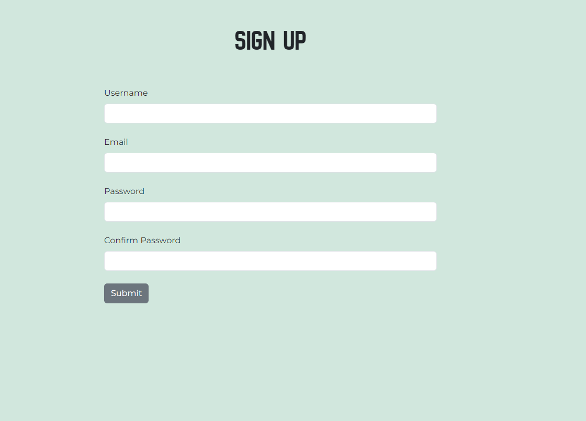
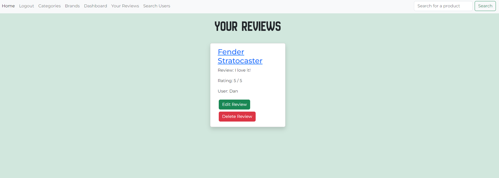

# Music Gear Review - Testing Document

## CONTENTS
* [Manual Testing](#Manual-Testing)
  * [Full Testing](#Full-Testing)
* [W3C Validator](#W3C-Validator)
* [Lighthouse Testing](#Lighthouse-Testing)
* [Wave Accessibiliy Testing](#Wave-Accessibility-TSesting)
* [Python Checker](#Python-Checker)
* [Bugs](#Bugs)
  * [Solved Bugs](#Solved-Bugs)
* [Testing User Stories](#Testing-User-Stories)

## Manual Testing

### Full Testing

The site was tested on the following systems:

* Cyberpower Ryzen 5 - OS: Windows 11 v23H2
* Samsung Galaxy A52S 5G

This was also tested on the following browsers:

* Google Chrome - Version 125.0.6422.77 (64-bit)
* Microsoft Edge - Version 125.0.2535.51 (64-bit)
* Mozilla Firefox - Version 126.0 (64-bit)

#### Login Testing

## Python Linter

### __init.py

### run.py

### forms.py

### model.py

### routes.py

## W3C Validator

# Home Page

![Home]

# Login Page

# Sign Up Page

# Brands Page

# Categories Page

# Search Page

# Add Product Page

# Dashboard

### Stylesheet Validator

## Wave Accessibility Testing

### Home Page

## Testing User Stories

1. To be able to search for items within the database

2. To be able read reviews for different items within the database

!

3. To be able to add new products to the database, if a user cannot see their desired product

#### First Time Visit Goals

1. To be able to sign up to the site with a unique username and password

2. To be able to leave/delete their own reviews for a specific product

#### Returning Visitor Goals

1. To be able to have a unique account that they can login into (created from signing up)

2. To be able to edit their account information, i.e. username and password

3. To be able to view their own reviews easily.

4. To be able to delete their personal accounts if they wish

